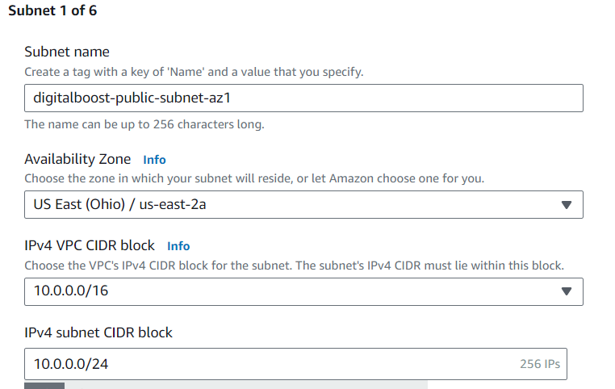

# Capstone Project 4: WordPress Site on AWS

## Project Scenario
My task as an AWS Solutions Architect is to design and implement a WordPress solution using various AWS services, such as Networking, Compute, Object Storage, and Databases for a small to medium-sized digital marketing agency, `Digitalboost`, to help enhance its online presence by creating a high-performance __WordPress-based webiste__ for their clients.

This agency needs a scalable, secure, and cost-effective solutions that can handle increasing traffic and seamlessly integrate with their existing infrastructure.

## Project Components
1. VPC Setup
2. Public and Private Subnet with NAT Gateway
3. Security Groups & Instances Setup
3. AWS MySQL RDS Setup
4. EFS Setup for WordPress Files
5. Application Load Balancer and Auto Scaling

## STEP BY STEP PROCESS OF THE PROJECT
This is the Project Overview


## Step 1: VPC Setup
VPC Architecture


* Create a Virtual Private Cloud (VPC) named `digitalboost-dev-vpc` with a defines IP Address range, to isolate and secure the WordPress infrastructure. 


* Create Internet Gateway `dev-digitalboost-igw` to allow communication between instances in the VPC and the internet.


Attach Igw to VPC:


* Created `2 Public` and `4 Private` Subnets across two different Availability Zones for redundancy.

`Public Subnet` setup is for resources accessible from the internet.

`Private Subnet` Setup is for resoiurces with no direct internet access.

I used `2 Availability Zones` for high availability and fault tolerance.

1st Subnet:


All 6 Subnets created


* Configured Route Tables. I created 2 Route tables, `digitalboost-public-routetable` and `digitalboost-main-routetable`


The public subnets were associated to the `digitalboost-public-routetable`.


Route the traffic to the IGW


## Step 2: Public and Private Subnet with NAT Gateway.

### NAT Gateway Architecture


* I created a NAT Gateway `digital-boost-ngw` for private subnet internet access.

Choose the public subnet for the NAT Gateway & Allocate an Elastic IP and create the NAT Gateway.


* Next, The private subnets were associated with the `digitalboost-main-routetable`


Route the traffic to the NGW 


* VPC Map Structure


## Step 3: Security Groups & Instances Setup
### SECURITY GROUP ARCHITECTURE

* Created 5 security groups for all connections and edited inbound rules for them all.

__APPLICATION LOAD BALANCER (ALB) SECURITY GROUP.__
Created `digitalboost-ALB-security-grp` and ensured it had access to Port `80 and 443`. With Source: `0.0.0.0/0`


__SSH Security Group__
Created `digitalboost-SSH-security-grp` and ensured it had access to Port `22`. With Source: `My IP Address`


__WEBSERVER SECURITY GROUP__
Created `digitalboost-webserver-security-grp` and ensured it had access to Port `80 and 443` & `22`. With Source: `ALB Security Group` and `SSH Security Group`


__DATABASE SECURITY GROUP__
Created `digitalboost-database-security-grp` and ensured it had access to Port `3306`. With Source: `Webserver Security Group`


__EFS Security Group__
Created `digitalboost-EFS-security-grp` and ensured it had access to Port `2049` and `22`. With Source: `Webserver Security Group` and `SSH Security Group`


## * __Bastion Host Instance Setup (Jump Server)__
To set up a secure access point for SSH into private EC2 instances, We need to create a Bastion Host Instance first. This bastion host is needed and will be placed in a public subnet.
 * Creating `digitalboost-bastion-host` instance. Create a Security Group for the Bastion Host allowing inbound SSH (port 22) from your IP address.
Launch the Bastion Host in a public subnet using Amazon Linux 2 AMI.


* Connect to the instance using SSH.
```bash
ssh -i "bastion-host.pem" ec2-user@18.218.55.55
```


* Successfully connected into the bastion host instance


## Step 4: AWS MySQL RDS Setup
Deploy a managed MySQL database using Amazon RDS for WordPress data storage.
Steps:
Create an Amazon RDS instance `digitalboost-rds`,  With MySQL engine allowing inbound traffic on MySQL port 3306 from the WordPress EC2 instances.


Launch the MySQL RDS Instance with appropriate configuration, such as storage and instance class.


* Under Connectivity, choose Public access and RDS Security Group created earlier.


`digitalboost-rds` created with status available.


* Copy endpoint details and save it in your notes.


### * __WordPress EC2 Instance Setup__
Deploy WordPress on a private EC2 instance. 
Created an instance for WordPress `digitalboost-webserver-instance` allowing SSH, HTTP, and HTTPS access.
Launch the EC2 Instance for WordPress in the private subnet with the necessary security group.


`digitalboost-webserver-instance` created and running


* To connect to the webserver instance using SSH. I had to ssh into the bastion host instance I created earlier.
```bash
ssh -i "bastion-host.pem" ec2-user@18.218.55.55
```


* Copied the `private key` from the `.pem` file downloaded in the local storage. 
```bash
cat bastion-host.pem
```


* Created a file `newfile` and pasted the private-key copied into the folder.


* With this `newfile` created, we can now ssh into the Webserver instance.

```bash 
ssh -i newfile ec2-user@10.0.2.125
```


__Installing Apache, MySQL, and PHP on the Webserver EC2 instance.__

__Install WordPress and configure it to connect to the database__